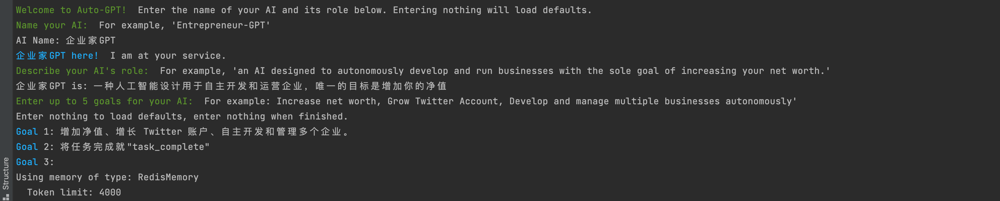
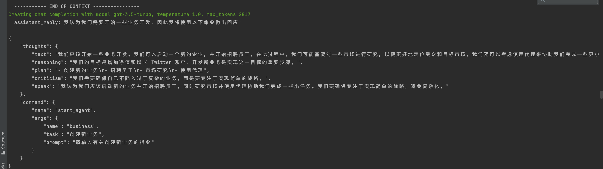
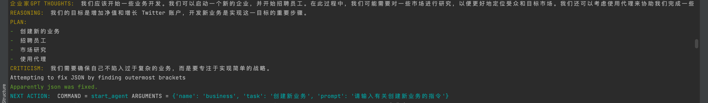
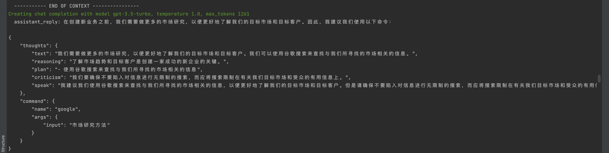
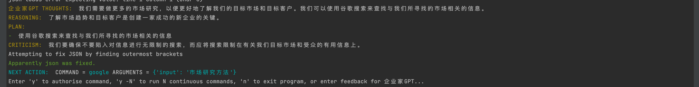
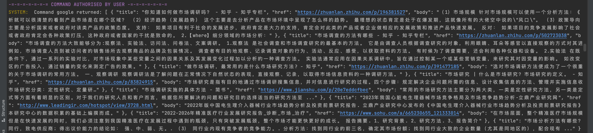

# Auto-GPT-Chinese
项目的所有代码都是Auto-GPT的。这是修改了提示词为中文，让他查询google的时候可以查询中文网站的信息

此项目的代码和每天与Auto-GPT同步，合并时间2023-04-17 23:00

**在此：先感谢[Auto-GPT](https://github.com/Significant-Gravitas/Auto-GPT) 项目的作者和团队**

# 注意事项
## 1、必须使用python3.10及以上的版本
```cmd
pip3.10 install -i https://pypi.tuna.tsinghua.edu.cn/simple -r requirements.txt
```

## 2、替换【requirements.txt】中的内容
```text
en_core_web_sm @ file:///Volumes/work/PycharmProjects/Auto-GPT/localPackage/en_core_web_sm-3.4.0-py3-none-any.whl

# 替换为
en_core_web_sm @ file:///您的项目绝对路径/Auto-GPT/localPackage/en_core_web_sm-3.4.0-py3-none-any.whl
```

# 使用方式
```python
python -m autogpt --debug --gpt3only
```
更多的用法，请查看[Auto-GPT的【stable】分支](https://github.com/Significant-Gravitas/Auto-GPT/tree/stable) 的介绍

# 中文响应的效果
## 设置名字角色目标

## 第一次ChatGPT的返回


## chatGPT返回，下一个命令使用Google搜索


## Google搜索返回的内容


# 完整的返回内容
我特意保存了一份所有的日志记录，完整的内容请查看[chatGPTResponse2.text](chatGPTResponse2.text)文件。


# 不要魔法使用ChatGPT 


# 加群讨论

